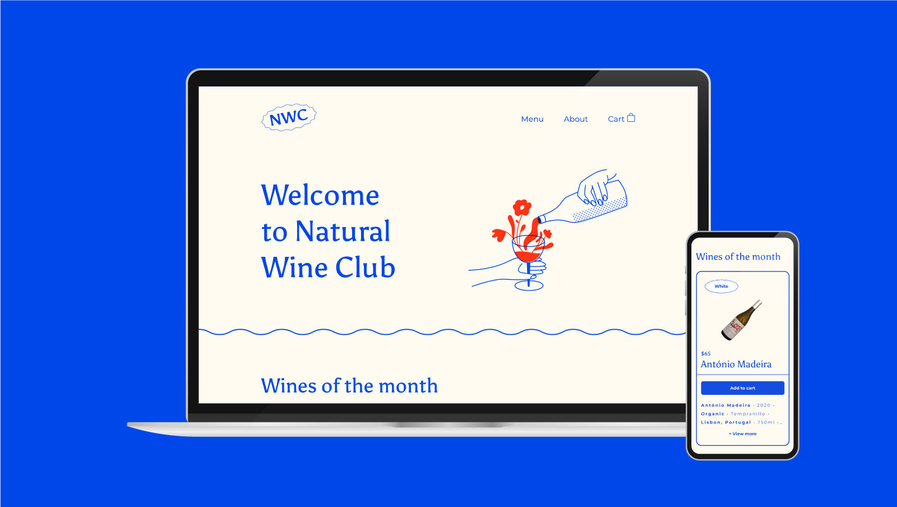

# Natural Wine Club

## About this project

Natural Wine Club is a small React-based application developed as a portfolio project to showcase my skills in web development. The website allows users to explore and purchase a curated selection of natural wines, and go through a simulated checkout process when they're ready to make a purchase,  all while being wrapped in a beautiful yet simple design.

Learn more about this project below 👇 


## Table of contents

- [Project Overview](#project-overview)
  - [Live Demo](#live-demo)
  - [Screenshot](#screenshot)
  - [Features](#features)
  - [Built with](#built-with)
- [My process](#my-process)
  - [How did I build it](#how-did-i-build-it)
  - [What problem did I set out to fix](#what-problem-did-i-set-out-to-fix)
  - [What were some of the design decisions](#what-were-some-of-the-design-decisions)
  - [What I learned](#what-i-learned)
  - [What I would change if I had more time](#what-i-would-change-if-i-had-more-time)
- [Author](#author)
- [Acknowledgments](#acknowledgments)

## Project Overview

### Live Demo

Check out the live demo of the website: [naturalwineclub.co](https://naturalwineclub.co/)


### Screenshot




### Features

- **Browse Wines**: Explore a diverse collection of natural wines with detailed descriptions, including tasting notes and origin details.
- **Shopping Cart**: Add wines to your shopping cart, review your order, and proceed to checkout seamlessly.
- **Checkout**: Enjoy a simulated and smooth checkout process that calculates sales tax and final purchase price.

 
### Built with

- Semantic HTML5 markup
- CSS custom styling
- Flexbox
- CSS Grid
- Mobile-first workflow
- [React](https://reactjs.org/) - JS library
- [Framer Motion](https://www.framer.com/motion/) - React motion library
- [React Hamburger](https://hamburger-react.netlify.app/) - Animated hamburger menu icons made for React


## My process

My goal for this project was to develop a small e-commerce web application using React. Below are the tools and technologies I utilized throughout the development process:

- **Design**: To create the website's design, I utilized Figma. You can find the design file [here](josh-merrill.com).
- **Code Editor**: For writing and editing the code, I relied on VSCode.
- **Version Control**: To manage the project's source code and track changes efficiently, I used Git and GitHub, which simplified my version control operations.
- **Frontend Framework**: As the foundation of this web application, I utilized React, which allowed me to build a dynamic and responsive user interface.
- **Deployment**: For deploying the web application, I chose Vite, a build tool that ensures fast and optimized development and production builds.


### How did I build it?

I built this application using HTML/CSS and React JS with Vite as the development tool. The wine menu array is fetched from a local JSON file, which replicates the behavior of a standard API fetch. The data is treated as regular JSON and deconstructed accordingly. Each wine card displays additional details, including the wine type, grapes used, country of origin, and more.


### What problem did I set out to fix?

The purpose of the project was to simulate an experience that is simple, and user-friendly, all while simulating a real-world e-commerce website where users can view a wine menu, add it to their cart, and complete a checkout process.


### What were some of the design decisions?

This project was inspired by a natural wine shop’s menu I came across while traveling throughout Portugal. I loved the layout and the simple, yet clean look of the design. The illustrations were created by my partner and talented designer, Hailey Coral, while the icons came from the React-Icons npm package.

As far as user experience, I wanted to create a design that was simple and not overly complex. One particular design decision was to include a cart option beneath the menu so that users had quicker access to the “view cart” option and provide users with the ability to “View more” information about each wine on their individual product cards using conditional rendering.

### What I learned

In this project, I learned how to efficiently manage and share state between components using the Context API. Specifically, I achieved shared state management for the `cartItems`, `viewCart`, and `totalOrderCount` properties across the `WineItem`, `Menu` and `Cart` components, enhancing the user experience for both mobile and desktop versions.

**Shared State with Context API**

In the `AppContext.jsx` file, I set up the `Context` using `createContext()` and defined a `ContextProvider` component to wrap the entire application. This provider component exposes the shared state (`cartItems`, `viewCart`, `totalOrderCount`) and relevant setter functions to all nested components.

```jsx
// AppContext.jsx

import { useState, createContext } from "react";

const Context = createContext(); // The correct name is Context, not WineContext.

function ContextProvider({ children }) {
  const [cartItems, setCartItems] = useState([]);
  const [viewCart, setViewCart] = useState(false);
  const [totalOrderCount, setTotalOrderCount] = useState(0);

  // ... (addToCart, removeFromCart, emptyCart, handleCart functions)

  return (
    <Context.Provider
      value={{
        cartItems,
        viewCart,
        setViewCart,
        handleCart,
        addToCart,
        removeFromCart,
        emptyCart,
        totalOrderCount,
      }}
    >
      {children}
    </Context.Provider>
  );
}

export { ContextProvider, Context };
```

Then, in the `Cart.jsx`, `WineItem.jsx`, and `Menu.jsx` components, I accessed the shared state and the corresponding setter functions using the `useContext` hook from React, referring to the `Context` as the correct variable name.

```jsx
// Cart.jsx

import { useContext } from "react";
import { Context } from "../../context/AppContext"; // Importing the correct context name.

export default function Cart() {
  const { cartItems, addToCart, removeFromCart, setTotalOrderCount, /*...*/ } = useContext(Context);

  // ...
}

// WineItem.jsx

import { useContext } from "react";
import { Context } from "../../context/AppContext"; // Importing the correct context name.

export default function WineItem({ item }) {
  const { cartItems, addToCart, removeFromCart, setTotalOrderCount, /*...*/ } = useContext(Context);

  // ...
}

// Menu.jsx

import { useContext } from "react";
import { Context } from "../../context/AppContext"; // Importing the correct context name.
import menuData from "../data/menu.json";
import Reveal from "../../utils/Reveal";
import WineItem from "./WineItem";
import Cart from "../cart/Cart";

export default function Menu() {
  const { viewCart, handleCart } = useContext(Context); // Accessing the viewCart and handleCart from the correct Context.

  const { menu } = menuData;

  // Rest of the code...
}
```

By doing so, I eliminated the need to pass props down multiple levels between these components, resulting in more organized and easily maintainable code.

**Conclusion**

Through this project, I deepened my understanding of state management with the Context API, enabling seamless communication between the `WineItem`, `Menu` and `Cart` components. As a result, I created a more streamlined and enjoyable user experience for visitors to the Natural Wine Club E-commerce Website.


### What I would change if I had more time

In the future, I would like to the Natural Wine Club by incorporating a database using Firebase. Doing so would allow me to expand the inventory available to users and offer a wider range of natural wines. I would also implement authentication through Firebase to provide users a way to create personalized profiles, log in, and keep track of their orders and purchase history. This personalization will enable features such as saving favorite wines and receiving tailored recommendations. Lastly, I would love to integrate Firebase's secure payment system, facilitating smooth and secure online transactions for customers during the checkout process.


## Author

**Joshua Merrill**

- [Portfolio](https://www.josh-merrill.com)
- [Github](https://github.com/josh-merrill)
- [LinkedIn](https://www.linkedin.com/in/joshmmerrill/)
- [Email](mailto:joshmmerrill@outlook.com?subject=Hello!)


## Acknowledgments

I would like to extend my gratitude to everyone who played a role in the development of this project. First and foremost, a special hat-tip goes to Bob Ziroll, Scrimba's incredible React instructor. His expertise and guidance were instrumental in shaping my skills and knowledge throughout this journey.

I also want to express my appreciation to all the dedicated instructors at Scrimba. Their valuable teachings and inspirational solutions have been a constant source of motivation, pushing me to improve and innovate in my web development endeavors.
